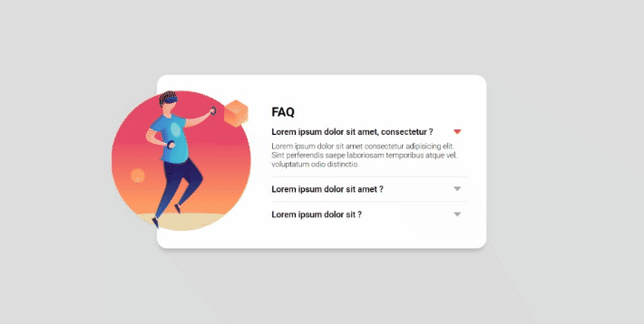

# Carrossel Imagens

Esse projeto consistiu em construir um card de perguntas e respostas com efeito de Acordeon.

## Desafio

Criar uma acordeon das respostas utilizando JavaScript, para aprimorar habilidades de eventos em JS e como adicionar/retirar classes de elementos.

O card de FAQ tem três perguntas, suas respostas aparecem ao evento de clique na respectiva pergunta, ocultando a resposta amostra anteriormente. Caso seja o evento de clique seja na pergunta com a resposta já amostra, ela também deve ser ocultada.

## Screenshots

Desktop

## Tecnologias utilizadas

- HTML
- CSS
- JavaScript